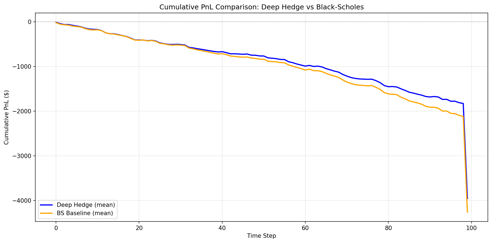
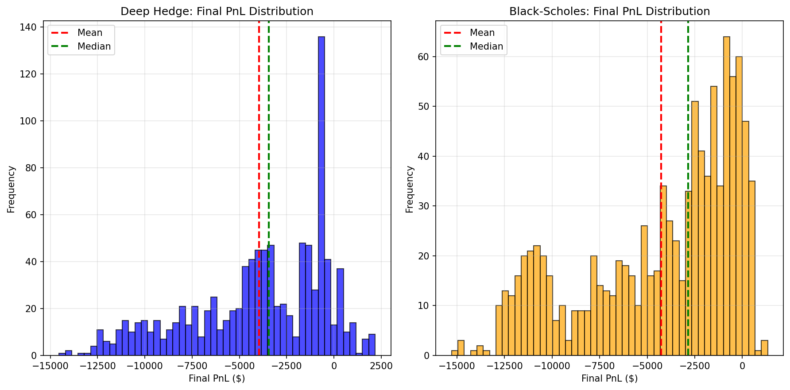
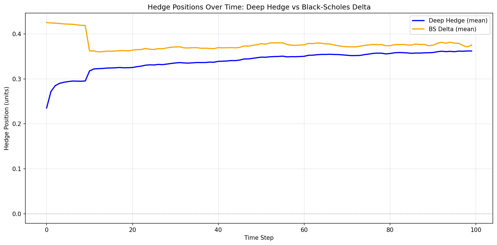
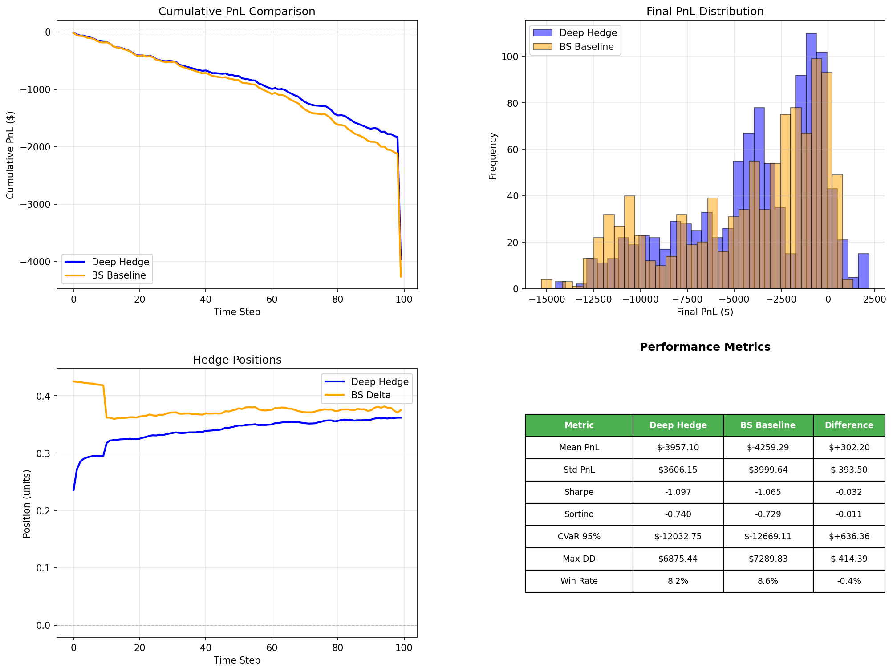

# Backtest Report
**Generated:** 2025-11-11 07:01:06
**Paths:** 1,000 | **Steps:** 100

## Configuration
- **start_date**: 2025-01-01
- **end_date**: 2025-09-25
- **strike**: 110000
- **maturity_days**: 33
- **model_path**: /workspace/pfhedge/models/iteration_16_c7f280ef/model.pth
- **call**: True
- **n_bootstrap_paths**: 1000
- **transaction_cost**: 0.0004
- **dt_hours**: 8.0
- **volatility_window**: 20
- **underlying_type**: perpetual
- **band_width**: 0.001
- **data_dir**: /workspace/pfhedge/crypto/data/historical
- **data_file**: btc_spot_8H_2025-01-01_2025-10-28.parquet
- **output_dir**: /workspace/pfhedge/configs/backtest_results/iteration_16
- **bootstrap_mode**: absolute_strike
- **initial_spot**: None
- **target_moneyness**: None
- **spot_tolerance**: 0.1
- **enable_diagnostics**: False
- **seed**: 42
- **save_raw_data**: True

## Performance Summary

### Deep Hedge
- **Mean PnL**: $-3,957.10
- **Std PnL**: $3,606.15
- **Sharpe Ratio**: -1.097
- **Sortino Ratio**: -0.740
- **CVaR (95%)**: $-12,032.75
- **Max Drawdown**: $6,875.44
- **Win Rate**: 8.2%

### Black-Scholes Baseline
- **Mean PnL**: $-4,259.29
- **Std PnL**: $3,999.64
- **Sharpe Ratio**: -1.065
- **Sortino Ratio**: -0.729
- **CVaR (95%)**: $-12,669.11
- **Max Drawdown**: $7,289.83
- **Win Rate**: 8.6%

### Comparison (Deep - BS)
- **Mean PnL Diff**: $+302.20
- **Sharpe Diff**: -0.032
- **CVaR Diff**: $+636.36

## Visualizations

### PnL Comparison

### PnL Distribution

### Hedge Positions

### Summary

